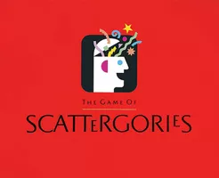
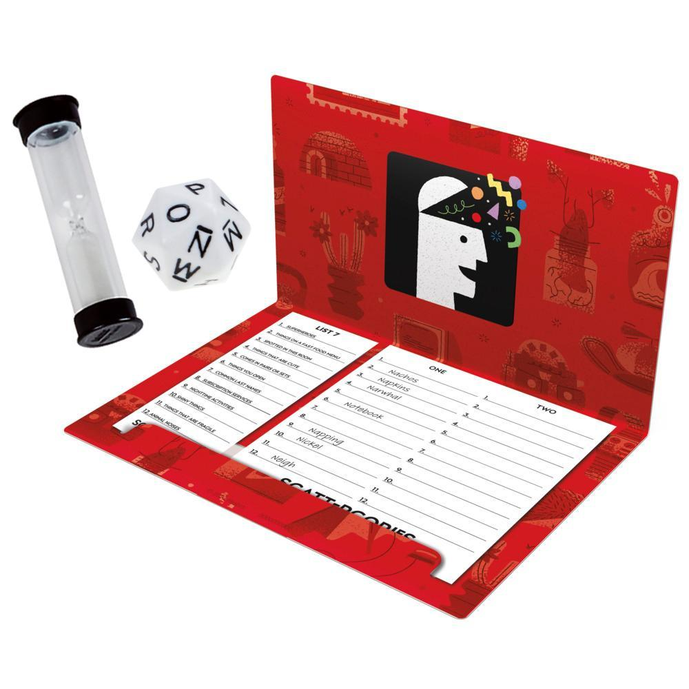

```{r setup, include=FALSE}
knitr::opts_chunk$set(echo = TRUE)
options(width = 20)
```

## Scattergories

```{r scattergories-box, echo=FALSE, fig.cap="", out.width = '20%'}


```

[Scattergories](https://shop.hasbro.com/en-us/product/classic-scattergories-game-party-game-for-adults-and-teens-ages-13-and-up-board-game-for-2-plus-players/A575A605-E267-4F93-B389-3861C0ACAE8C) was
publised by Milton Bradley in 1988. 

Each round a category is introduced and a random letter is chosen 
(rolled in the original game). 
Each team comes up with up to 12 examples in that category that start with the
chosen letter. 
One point is awarded if you are the only team to name that example.
After 6 (or some number of) rounds, the team with the highest score wins. 

## Random Letters

Available letters:

```{r scattergories-letters}
scattergories_letters <- LETTERS[-c(17, 21:22, 24:26)]
print(scattergories_letters, quote = FALSE)
```

Randomly choose letters:

```{r random-letters}
random_letters <- sample(scattergories_letters)
```


## Category 1 - Individual, independent sport

Name a sport where individuals compete and earn a time, distance, or score,
that is (mostly) independent of other individuals' time, distance, or score.
For example,

- Cross-country running

Letter: 
```{r individual-independent-sport-letter}
random_letters[1]
```

## Category 2 - Team, independent sport

Name a sport where a team, i.e. group of individuals, 
compete and earn a time, distance, or score,
that is (mostly) independent of other teams' time, distance, or score.
For example,

- Jigsaw puzzle speed competition


Letter: 
```{r team-independent-sport-letter}
random_letters[2]
```

## Category 3 - Individual head-to-head sport

Name a sport where individuals compete head-to-head and, in each game, 
exactly one is pronounced the winner.
Head-to-head means that the individuals can play defense, i.e. actively try to 
stop the other individual from doing what they want to do.
For example,

- Tennis


Letter: 
```{r individual-head-to-head-sport-letter}
random_letters[3]
```

## Category 4 - Team head-to-head sport

Name a sport where teams compete head-to-head and, in each game, exactly one is 
pronounced the winner.
Head-to-head means that the teams can play defense, i.e. actively try to 
stop the other team from doing what they want to do.
For example,

- League of Legends


Letter: 
```{r team-head-to-head-sport-letter}
random_letters[4]
```


## Category 5 - Individual free-for-all sport

Name a sport where individuals compete against more than one other individual 
and, in each game, exactly one is pronounced the winner.
Free-for-all means that individuals can interact with one or more opponents
(defense, scoring on, etc.).
For example,

- Magic the Gathering Free-For-All


Any Letter

## Category 6 - Team free-for-all sport

Name a sport where teams compete free-for-all and exactly one is 
pronounced the winner.
Free-for-all means that teams can play defense on one or more opponents.
For example,

- ???


Any Letter

